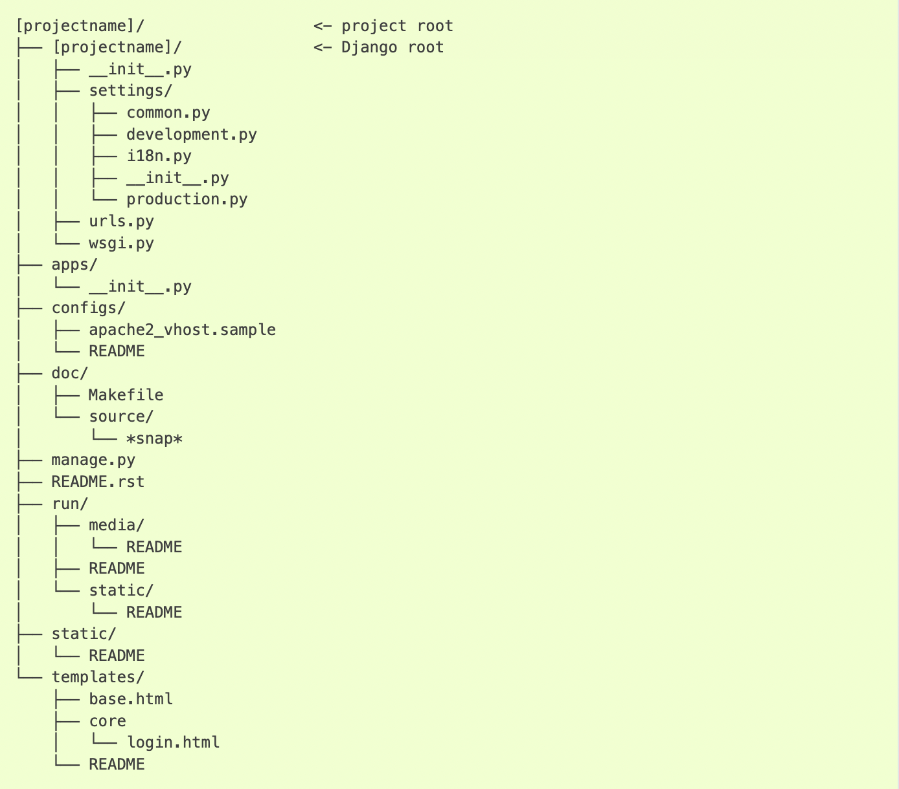
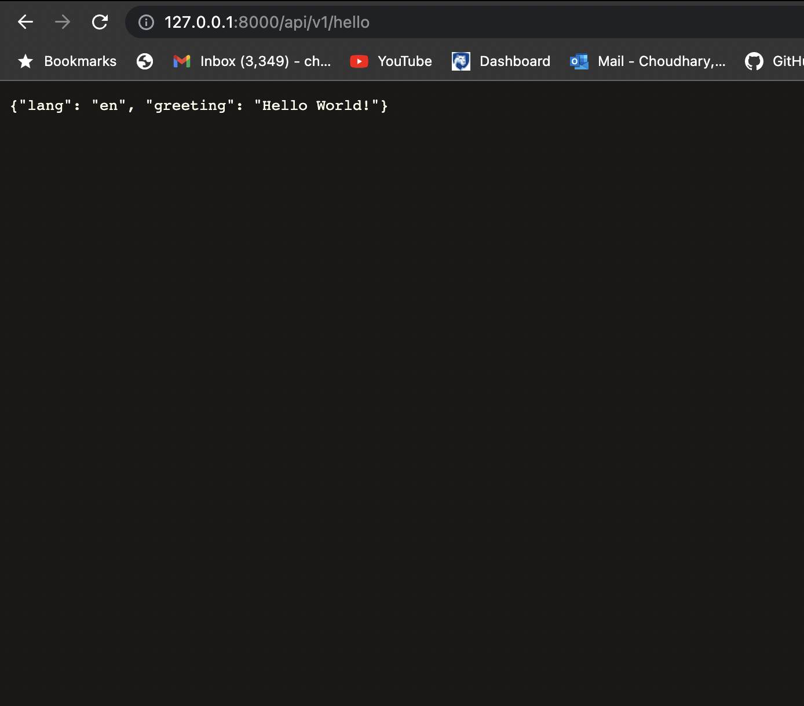

# To test this please combine this repo with my other repo QApply frontend

## Disclaimer: localhost is harcoded so please run on localhost

**Following django project file structure**

**This is why I have two files with the same name.**

## ISSUE 04 create tests
**created tests [HERE](./Qapply_Play/tests.py)**

*Passing tests above*

*Failing tests above*
